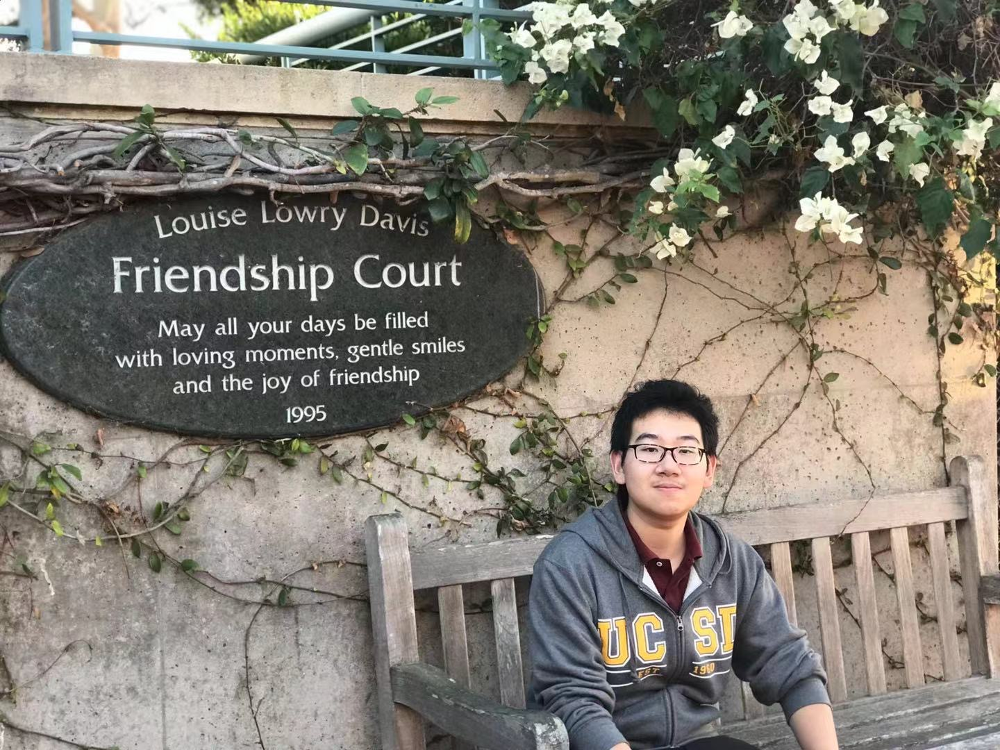

# Zihan Qu

## About Me:


## Summary:
**Experience programming, analyzing, and computing project through Computer Science and Engineer, Statistics, and Mathematics classes. 
Achieve a strong background in computation and analysis developed through coursework. Work effectively within a group as well as independently with minimal supervision. 
Proven leadership and public speaking abilities through student organizations and work experience.**

## Education:
**University of California, San Diego**

**Mathematics w/ specialized in Computer Science**

## Intern experience:

```
project:
DNA sequence alignment and pattern matching
Abnormal detection based on Markov Chain

```
## My recent code signature:
```
bool queryPrtComp::operator()(Query*& lhs, Query*& rhs) const;
```

## Skills
- Java
- C++
- Objective-C
- C
- Python
- JavaScript
- 
## Hobbies
1. Photography

## Interesting projects other than internship or lab:
- [x] Enigma Encode and decode
- [x] DNA sequence acceleration using BLAST 

> Start early and often

My Github Page [Github Pages](https://github.com/QzhStarkInternational).

[README for this assignment](README.md)


[Go to top](#Hobbies)
